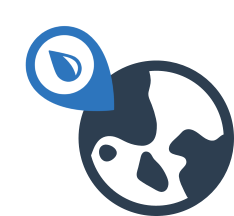

.. pyWaterML documentation master file, created by
   sphinx-quickstart on Tue Dec  1 18:57:18 2020.
   You can adapt this file completely to your liking, but it should at least
   contain the root `toctree` directive.

=====================
|pywaterml| pyWaterML
=====================

PyWaterMLis a python package developed by the Hydroinformatics laboratory in the Civil Engineering at Brigham Young University.
PyWaterML allows the user to work with WaterOneFlow (WOF) web services that are compliant with the WaterML 1.0 format. The package lets you connect
to any WOF web service such as the 'Consortium of Universities for the Advancement of Hydrological Science, Inc.' ('CUAHSI') WOF web services.
PyWaterML strives to be an intuitive python package for accessing WaterML information through WOF web services,
and it also brings new functionality to the retrieved data from WOF web services.
PyWaterML also brings some basic machine learning clustering based on monthly average for different variables.

WOF Available methods:

1) GetSites(): Get all the sites from a endpoint that complies to the SOAP protocol. The GetSites() method is similar to the GetSites() WaterML method.

2) GetSitesByBoxObject(): Get all the sites from a bounding box from a endpoint that complies to the SOAP protocol. The GetSitesByBoxObject() method is similar to the GetSitesByBoxObject() WaterML method.

3) GetVariables(): Get all the variables from a endpoint that complies to the SOAP protocol. GetVariables() method is similar to the GetVariables() WaterML method.

4) GetSiteInfo(): Get the information of a given site. GetSiteInfo() method is similar to the GetSiteInfo() WaterML method.

5) GetValues(): Get the specific values for an specific variable in a site. GetValues() method is similar to the GetValues() WaterML method.

6) AvailableServices(): Get the WOF web services that are available from a WOF service containing a HIS catalog.

7) GetWaterOneFlowServiceInfo(): Get all registered data services from a given WOF Web service containing a HIS catalog. GetWaterOneFlowServiceInfo can be regarded as a special case of GetServicesInBox2, as the former requests the returns for the global area.

Extra functionality includes the following methods:

1) GetSitesByVariable(): Get the specific sites according to a variable search array from a endpoint that complies to the SOAP protocol. The GetSitesByVariable() is an addition to the WaterML methods because it allows the user to retrieve sites that contains the specific site/s.

2) GetInterpolation(): Interpolates the data given by the GetValues method in order to fix datasets with missing values. Three options for interpolation are offered: mean, backward, forward, default is mean interpolation.

3) GetMonthlyAverage(): Gets the monthly averages for a given variable, or from the response given by the GetValues method for a given site.

The following links will result useful to the users that want to contribute or experiment the package:

1) `Source Code <https://github.com/romer8/pywaterml>`__
2) `Gist Template <https://gist.github.com/romer8/89c851014afb276b0f20cb61c9c731f6>`__

.. toctree::
   :maxdepth: 1
   :name: mastertoc
   :caption: Modules:

   WaterOneFlow Methods <waterML>
   Extra Functionality Methods <analitica>
   Internal Methods <auxiliaryMod>

   About the BYU Hydroinformatics group <hydroinformatics>
